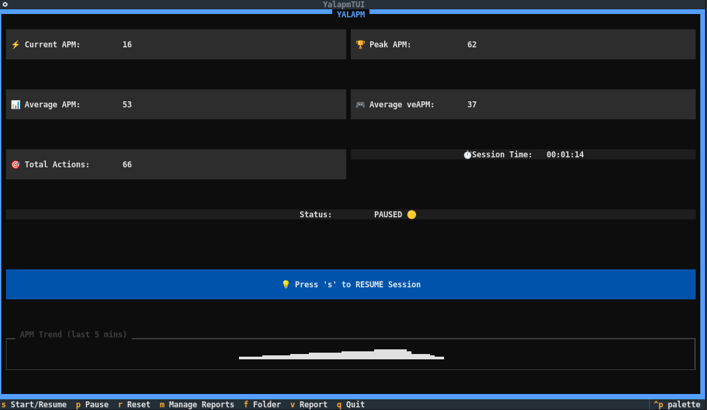
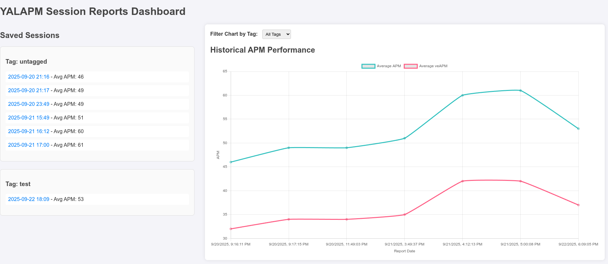

# YALAPM - Yet Another Linux APM Monitor

> 🚀 **A terminal-based Actions Per Minute monitor for Linux**  
> For tracking your performance during coding sessions and gaming

## 🎯 What is YALAPM?

YALAPM is a lightweight, system-wide APM (Actions Per Minute) monitor designed specifically for Linux users who want to track their keyboard and mouse activity during coding sessions, gaming, or any productivity work. Unlike web-based solutions, YALAPM runs natively on Linux and monitors **all** your actions across any application.

## ✨ Features

- 🖥️ **System-wide monitoring** - Tracks keyboard and mouse events globally
- 📊 **Real-time statistics** - Live APM, peak APM, average APM, average virtual effective APM and total actions
- 📉 **ASCII graph visualization** - Shows APM trends over time right in your terminal
- 📈 **Charts, tagging and report management** - Organize different sessions with tags, manage your reports and html generation for chart visualizations
- ⚡ **Lightweight** - Minimal resource usage, won't impact your workflow
- 🎮 **Gaming & coding ready** - Perfect for RTS games, competitive programming, or productivity tracking

- 🔧 **Some permission handling** - Smart detection and solutions for Linux permission issues
- 🌙 **Terminal-based UI** - Clean, distraction-free interface that works on any Linux setup

## 🚀 Quick Start

### Installation

1. **Clone or download YALAPM:**
```bash
wget https://raw.githubusercontent.com/splitpierre/yalapm/refs/heads/main/yalapm.py
# or save the script as yalapm.py
```

2. **Install dependencies:**
```bash
pip install pynput
# or
sudo apt install python3-pynput
```

3. **Run YALAPM:**
```bash
python3 yalapm.py
```

### First Run

When you start YALAPM, it will:
1. Check your system permissions
2. Show you the monitoring interface
3. Wait for your commands

## 🖼️ Interface Overview


---


### V1
```
╔══════════════════════════════════════════════════════════════╗
║                    LINUX APM MONITOR                         ║
╠══════════════════════════════════════════════════════════════╣
║  Current APM:        156 🔥                                  ║
║  Peak APM:           203 🏆                                  ║
║  Average APM:         89 📊                                  ║
║  Average veAPM:       56 🎮 (virtual 70%)                    ║
║  Total Actions:    4,521 🎯                                  ║
║  Session Time:    00:15:32 ⏱️                                ║
║  Status:       MONITORING 🟢                                 ║
╠══════════════════════════════════════════════════════════════╣
║  APM Trend (last 30s):                                       ║
║  ▃▅▇█▆▄▃▅▇██▆▄▂▁▃▄▆▇█▇▅▃▁▂▄▆▇█▇▅▃                            ║
╠══════════════════════════════════════════════════════════════╣
║  Press Ctrl+C to stop monitoring and see final report        ║
╚══════════════════════════════════════════════════════════════╝
```

## 🔧 Troubleshooting

### Permission Issues

If YALAPM shows "PERMISSION ERROR 🔴", try these solutions:

**Option 1: Run with sudo (quickest)**
```bash
sudo python3 yalapm.py
```

**Option 2: Add user to input group**
```bash
sudo usermod -a -G input $USER
# Then logout and login again
```

**Option 3: Install system package**
```bash
sudo apt install python3-pynput
```

**Option 4: Check your session type**
```bash
echo $XDG_SESSION_TYPE
```
- If it shows `wayland`, you might need to switch to X11 session
- If it shows `x11`, permissions should work better

## 💾 Basic Data Persistence

YALAPM automatically saves your session statistics to:
```
~/.apm_monitor_stats.json
```

This includes:
- Total actions in session
- Peak APM achieved
- Average APM
- Session duration
- Timestamp

## 🛠️ Technical Details

- **Language**: Python 3.6+
- **Dependencies**: `pynput` (for system-wide input monitoring)
- **Platform**: Linux (tested on Ubuntu, should work on most distributions)
- **Resource Usage**: < 10MB RAM, minimal CPU usage
- **Monitoring Method**: System-wide keyboard and mouse event capture

## 🤝 Contributing

Feel free to copy, modify, or contribute!

Found a bug? Want to add a feature? Contributions welcome!

1. Fork the project
2. Create your feature branch
3. Test on your Linux system  
4. Submit a pull request

---

**Made with ❤️ for the Linux community (and new influx of gamers).**

*May competitive RTS on linux be a thing, some day, right? 💭*

This code was generated by Claude.AI, then tested/adapted by me ;) I just couldn't find something simple, that works system-wide, minimum dependencies, to display APM on my coding/gaming sessions..


